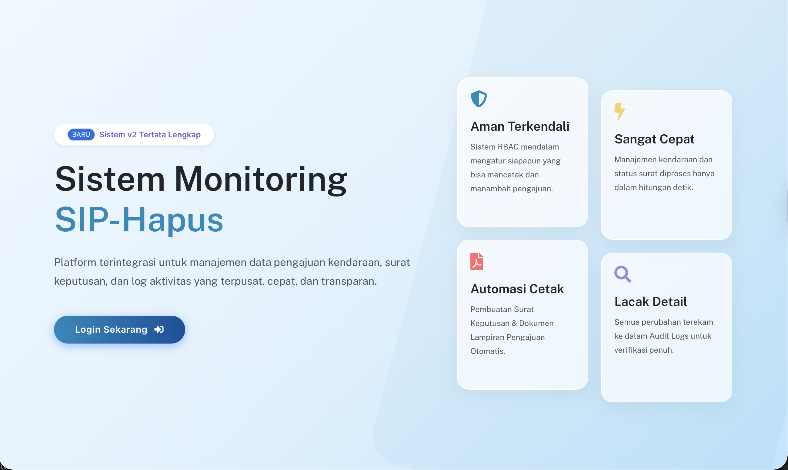
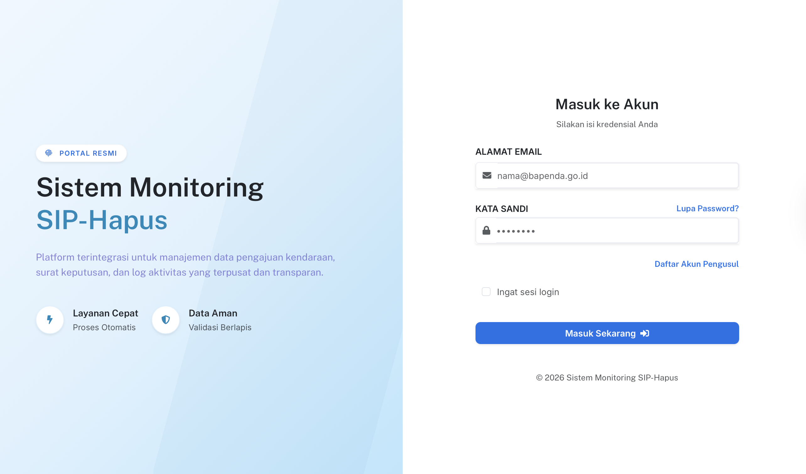
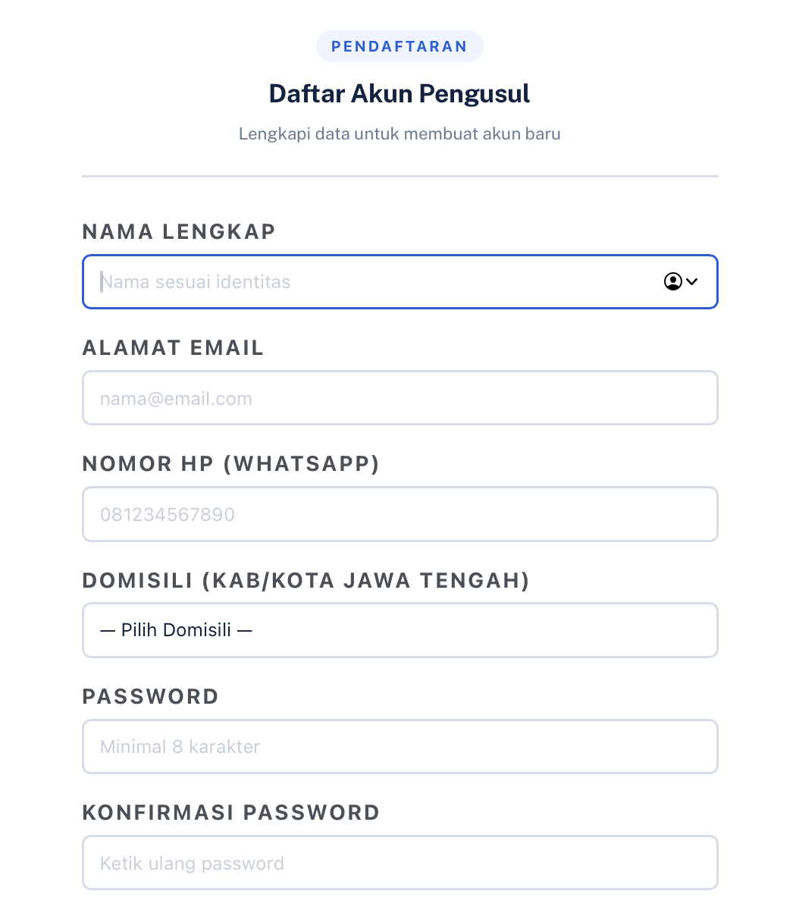
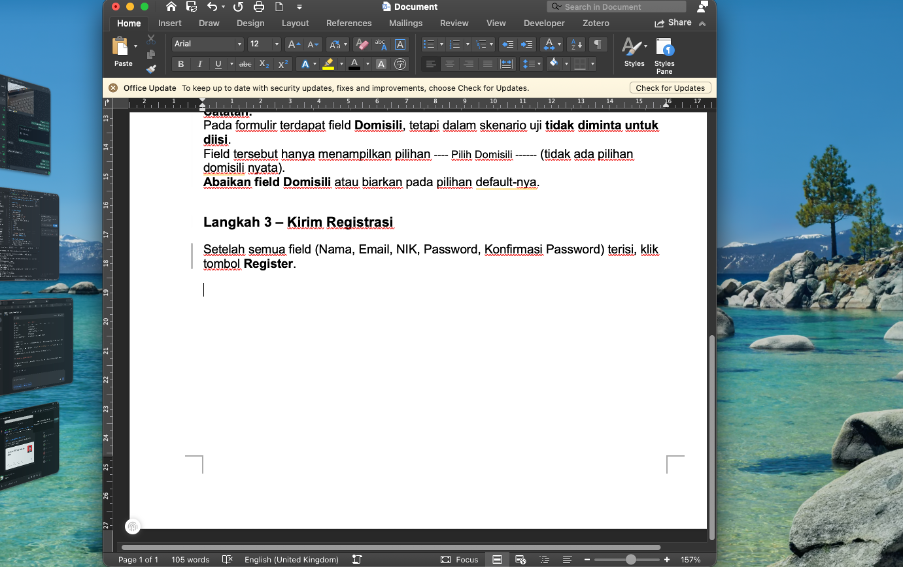

# Tutorial Registrasi Akun Wajib Pajak Baru

## Skenario
Halaman `/register` dapat diakses, pengguna belum memiliki akun.

## Langkah-langkah
1. Buka Website

2. Akses halaman `/register`.

2. Isi formulir dengan data valid:
   - Nama
   - Email
   - NIK
   - Password
   - Konfirmasi Password

   
3. Klik tombol **Register**.

## Hasil yang Diharapkan
- Akun Wajib Pajak (WP) berhasil dibuat.
- Pengguna diarahkan ke halaman verifikasi email atau dashboard.
- Data tersimpan dengan role **'Wajib Pajak'**.

## Catatan Masalah (Bug)
Pada pemilihan domisili, tidak ada pilihan domisili yang tersedia – hanya ada pilihan `'---- Pilih Domisili ------'`.